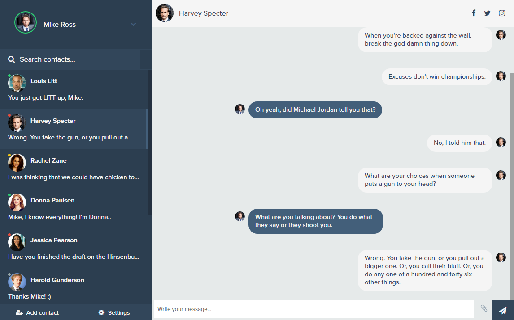

# Bootstrap Chat Example



The only requirement is [Docker](https://docs.docker.com/install/).

```sh
$ docker run --rm -it -p 8080:8080 neffos/bootstrap-chat
```

Github repository: https://github.com/neffos-contrib/bootstrap-chat
